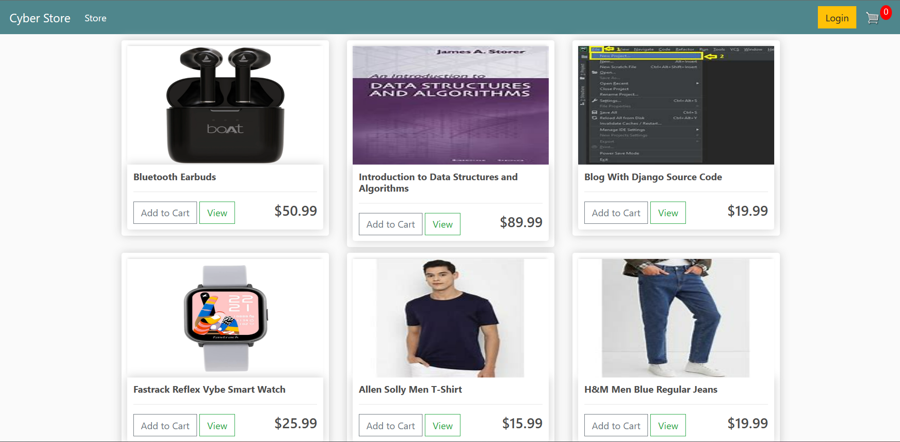
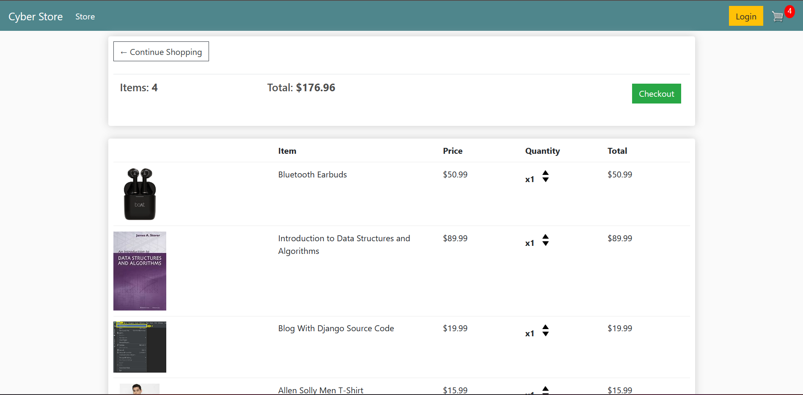

# Cyber-Store
Ecommerce Platform made with Django Platform for Digital and Physical Products selling. 
Cart for not logged in user also designed.
This project has been made with HTML, CSS, JavaScript and Django. Sqlite database has been used.

## Some glimpses of Project
### Home Screen

  
  ### Cart
  
  
  ### Checkout Screen
  
